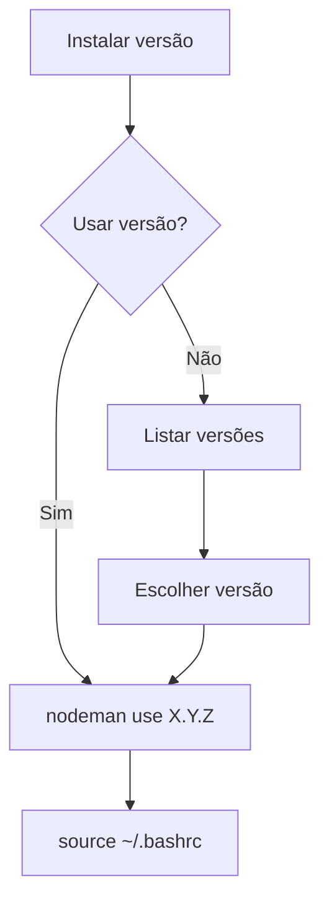

# NODEMAN - Node Version Manager

**Gerencie múltiplas versões do Node.js no Debian/Ubuntu**  
Uma ferramenta simples para instalar, alternar e remover versões do Node.js sem conflitos.

## 🎯 Objetivo
Facilitar a instalação e gerenciamento de múltiplas versões do Node.js em sistemas baseados em Debian/ Alma Linux, permitindo que desenvolvedores alternem entre versões conforme necessário para diferentes projetos.

## ⚙️ Requisitos do sistema
- **Sistema Operacional**: Debian 12 (Bookworm) ou Alma Linux 9.6
- **Dependências**:
  - `wget` - Para download de arquivos
  - `tar` - Para extração de pacotes
  - `bash` - Shell para execução dos scripts
- **Permissões**: Execução como usuário comum (não requer root)

---

## 📦 Como instalar o nodeman?

**No terminal com sua conta de usuário comum execute:**

```bash
wget -qO- https://raw.githubusercontent.com/souza-lb/nodeman/main/install | bash
```

Após a instalação, **reinicie seu terminal** ou execute:
```bash
source ~/.bashrc
```

--- 

## 📋 Comandos disponíveis

### ℹ️ Exibir ajuda
```bash
nodeman help
```

### 🔍 Listar versões instaladas
```bash
nodeman list
```

Exemplo de saída:
```
Versões Node disponíveis:
    18.12.1
--> 20.12.1
    22.14.0
```

### ⬇️ Instalar uma versão
```bash
nodeman install [URL/arquivo]
```

**Exemplos:**
```bash
# Instalar via URL oficial
nodeman install https://nodejs.org/dist/v22.16.0/node-v22.16.0-linux-x64.tar.xz

# Instalar arquivo local
nodeman install ~/Downloads/node-v22.16.0-linux-x64.tar.xz
```

### ⚡ Ativar uma versão
```bash
nodeman use [versão]
```

**Exemplo:**
```bash
nodeman use 20.12.1
```

Saída:
```
Versão 20.12.1 definida como padrão!
Execute 'source ~/.bashrc' para aplicar as mudanças!
```

### 🔌 Desativar versão atual
```bash
nodeman disable
```

Saída:
```
Versão 20.12.1 desativada com sucesso!
Execute 'source ~/.bashrc' para aplicar as alterações!
```

### 🗑️ Remover uma versão
```bash
nodeman remove [versão]
```

**Exemplo:**
```bash
nodeman remove 18.12.1
```

Saída com confirmações:
```
Deseja realmente remover a versão 18.12.1? [s/N]: s
Digite o número da versão para confirmar a remoção: 18.12.1
Removendo versao: 18.12.1...
Versão 18.12.1 removida com sucesso!
Execute 'source ~/.bashrc' para aplicar as mudanças!
```

---

## ⚙️ Estrutura de arquivos
O nodeman organiza os arquivos em:
```
~/.nodeman/
├── node_versions/     # Versões instaladas
│   ├── 20.12.1/
│   ├── 22.14.0/
│   └── current -> 20.12.1  # Link simbólico
└── node_env           # Configuração de ambiente
```

## 🔄 Pós-instalação
Após usar `use` ou `disable`, sempre execute:
```bash
source ~/.bashrc
```
Para aplicar as mudanças no ambiente atual.

---

## ❌ Mensagens de erro comuns
1. **Versão já instalada:**
   ```
   Erro: A versão '20.12.1' já está instalada!
   ```

2. **Remover versão em uso:**
   ```
   Erro: A versão '20.12.1' está em uso!
   Execute: 'nodeman disable' antes de tentar remover esta versão!
   ```

3. **Versão não encontrada:**
   ```
   Erro: Versão 18.12.1 não encontrada!
   ```

4. **Formato de versão inválido:**
   ```
   Erro: Formato inválido! Use X.Y.Z
   ```

---

## 🔄 Fluxo de trabalho típico



Passos detalhados:
1. **Instalar uma nova versão do Node**: `nodeman install [URL]`
2. **Decidir se deseja usar a versão imediatamente**:
   - Se sim: ativar a versão com `nodeman use X.Y.Z`
   - Se não: listar versões com `nodeman list`
3. **Para listagem de versões**:
   - Escolher uma versão específica
   - Ativar com `nodeman use X.Y.Z`
4. **Sempre após ativar/desativar**: `source ~/.bashrc`
5. **Executar aplicações Node**
6. **Quando necessário**:
   - Desativar versão atual: `nodeman disable`
   - Remover versões antigas: `nodeman remove [versão]`

---

## 🗑️ Como desinstalar?

**No terminal com sua conta de usuário comum execute:**

```bash
wget -qO- https://raw.githubusercontent.com/souza-lb/nodeman/main/uninstall | bash
```

---

## ❤️ Apoie o Projeto

**Dúvidas, sugestões e contribuições?**  
Leonardo Bruno  
souzalb@proton.me  

**Gostou do projeto e quer realizar uma contribuição voluntária?**  
*(Pode ser o valor de uma xícara de café ou chá...) ☕ 🍵*  

Chave PIX:  
`8dcc7e3c-0c6a-4c6f-a4c0-26a5e62686db`  

Ou utilize o QR Code abaixo:  

<p align="center">
  
</p>

**Você também pode utilizar o PayPal:**  

[](https://www.paypal.com/donate/?hosted_button_id=EQVW5QQ7GBGSY)

<p align="center">
  
</p>

**A utilização deste projeto é livre para alterações e adaptações**  
*Desde que feita a devida referência ao repositório original e seu criador.*
